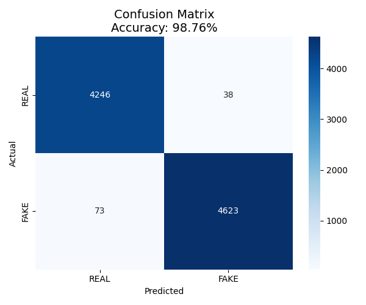

# Fake News Classifier – *VeritasML*

A machine learning pipeline to detect fake news using NLP and logistic regression. This project uses real-world datasets to build a classifier that distinguishes between fake and real news articles based on their textual content.

## Project Overview

**VeritasML** is a personal software project focused on detecting misinformation in digital news media using natural language processing techniques. It demonstrates end-to-end machine learning development, from data preprocessing to model evaluation and visualization.

## Project Structure

```
fake_news_classifier/
├── data/
│   ├── raw/               ← Raw CSV files (Fake.csv, True.csv)
│   └── processed/         ← Cleaned and ready-to-use datasets
├── models/                ← Saved ML model (.pkl)
├── src/                   ← Core scripts for pipeline
│   ├── data_loader.py     ← Load and clean data
│   ├── features.py        ← Text preprocessing & TF-IDF
│   ├── train.py           ← Model training
│   └── evaluate.py        ← Evaluation & visualization
├── prepare_data.py        ← Combines Fake/True data into one labeled CSV
├── main.py                ← Runs the full pipeline
├── requirements.txt       ← Required libraries
└── README.md              ← You are here
```

## Tech Stack

- **Language**: Python  
- **Libraries**: `scikit-learn`, `NLTK`, `Pandas`, `NumPy`, `Matplotlib`, `Seaborn`  
- **ML Algorithm**: Logistic Regression  
- **Feature Extraction**: TF-IDF  
- **Evaluation**: Accuracy, Classification Report, Confusion Matrix

## Dataset

- Source: [Kaggle – Fake and Real News Dataset](https://www.kaggle.com/clmentbisaillon/fake-and-real-news-dataset)
- Combined from `Fake.csv` and `True.csv`, labeled as:
  - `0`: Real News  
  - `1`: Fake News

## How to Run

1. **Clone the repo**
```bash
git clone https://github.com/yourusername/VeritasML.git
cd VeritasML
```

2. **Install dependencies**
```bash
pip install -r requirements.txt
```

3. **Place raw data**
Put `Fake.csv` and `True.csv` into `data/raw/`

4. **Prepare combined dataset**
```bash
python prepare_data.py
```

5. **Run the pipeline**
```bash
python main.py
```

## Sample Output

- Accuracy: `95%+` on validation set  
- Full classification report  
- Confusion matrix with heatmap

## Model Accuracy



## Author

**Yarkin Colak**  
ML Enthusiast | CE Student @ RWTH Aachen

## Future Ideas

- Integrate more advanced models (e.g., BERT)
- Build a simple Streamlit UI
- Add support for multilingual data
